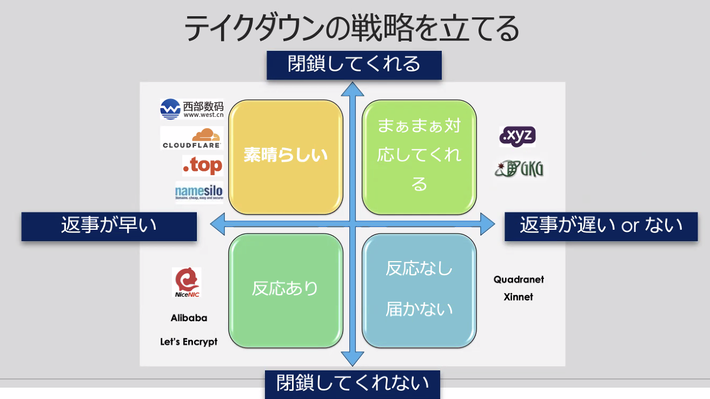

# AVTOKYO

## 今年もやってきましたAVTOKYOフィッシング語らナイトpart1

- URL を見分けようとしない
- HTTPS かどうかで判断しない
- TLD(.jp など) での判断は危険
- 本文に記載されたURLにはアクセスしない
  - お気に入り等に登録した情報からアクセス

##　AV TOKYOフィッシング落とさナイト

- フィッシングサイトのテイクダウンの話
- つながらないようにするのがベストだが、すぐにはできないので警告が出るようにする
- Domain Abuse report
- ドメインもホスティングもAbuse対応できない場合は証明書発行会社に無効化してもらう
- Cloudflare は通報すると数分で警告画面を出してくれるようになる
- メールで対応してくれない、対応が遅い場合でもSNSだとすぐに対応してくれるところがある
  - コミュニケーションを取るのが重要
- フィッシングメールが飛ぶ前にサイトを落とす
  - 予測ができる時は事前に対応、メールの文面を用意しておく
- CNAME の ServerHold で一括テイクダウン
- DNSゾーンへの Abuse Report

## 今年もやってきましたAVTOKYOフィッシング語らナイトpart2

- 技術部門以外の人との連携が大変
- テイクダウンまでの時間を KPI にしてしまうと地獄
- テイクダウンまでの工程や難しさ、限界を理解してもらうための資料作りが大事
- 目的は金銭
- 参入障壁が低い。たいした技術がなくてもできる
- 個人でやっているような、雑なサイトも多い
- フィッシングサイトをコピーしたフィッシングサイトもある
- どれだけUXにこだわっても、自分が正しいと信じている人は引っ掛かってしまう
  - 高齢者だけじゃなく若者も引っかかる
